Library Management

---
## Project Overview

This project is a library management system developed using Odoo v16. It aims to streamline library operations and enhance user interaction with the following key features:

- **Book Catalog Management**: Easily manage books with details like title, author, genre, and ISBN.
- **User Interaction**: Allow users to:
  - Browse available books on the website.
  - Contact the library for inquiries or support.
  - Choose courses related to library resources for certification.

## Library Operations

- **Add New Books**: Integrate new books into the system, including details such as title, author, and genre.
- **Manage Categories and Authors**: Organize books by categories and maintain author information.
- **Borrowers Management**: Manage patrons borrowing books and facilitate the loan process.
- **Track Loan Status**: Monitor the status of borrowed books, including overdue items and returned books.

## Reporting and Analytics

- **Generate Reports**: Provide comprehensive charts and reports for administrators to analyze:
  - Book categories and their inventory.
  - Borrowing statuses including overdue books and returns.
  - Other key metrics to optimize library operations.

---
## Screenshots
### <i style="color:#CCACFF;"><u>**Website**</u></i>
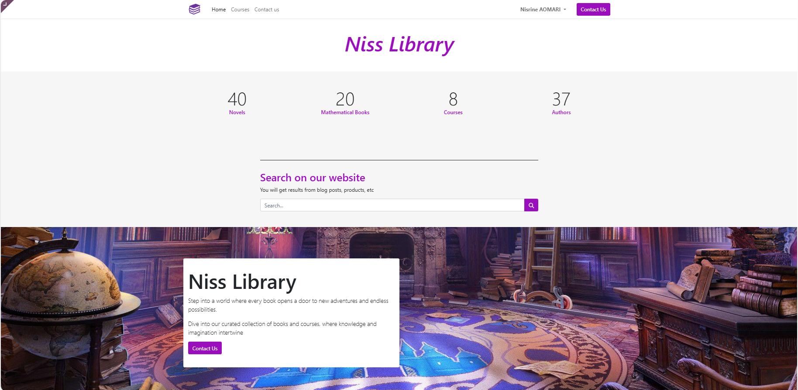
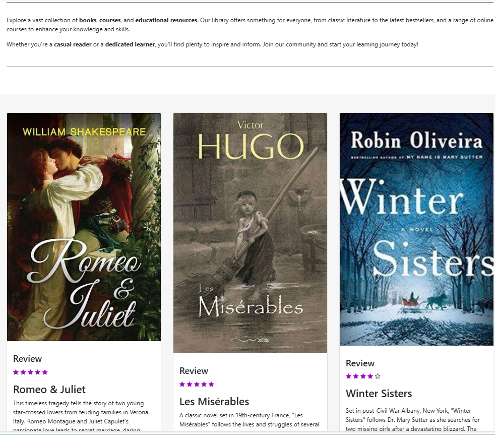
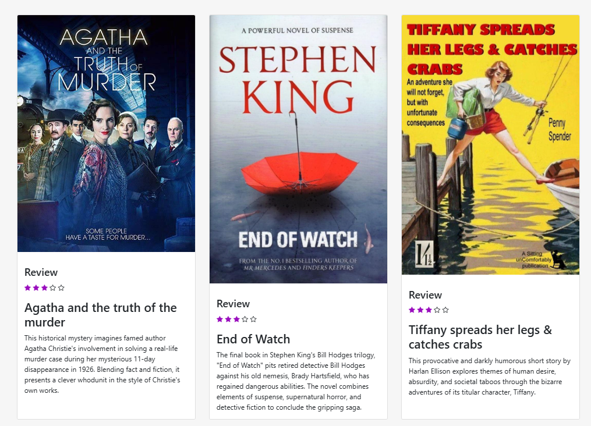
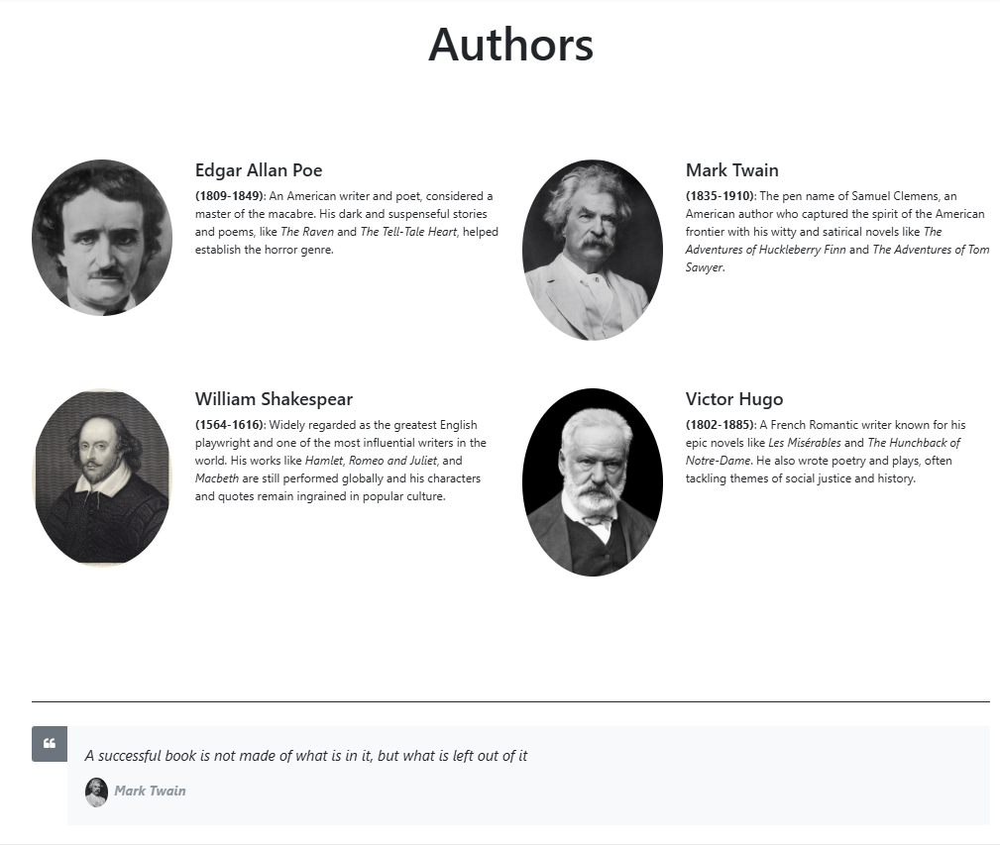

### <i style="color:#CCACFF;"><u>**Courses**</u></i>
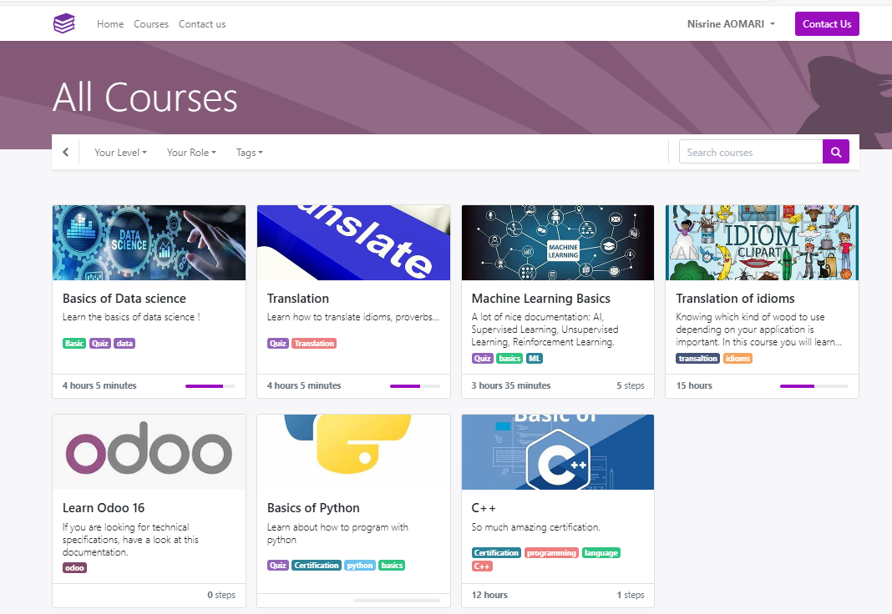

### <i style="color:#CCACFF;"><u>**Contact Us**</u></i>

### <i style="color:#CCACFF;"><u>**Library Management Module**</u></i>
* #### Books Section:
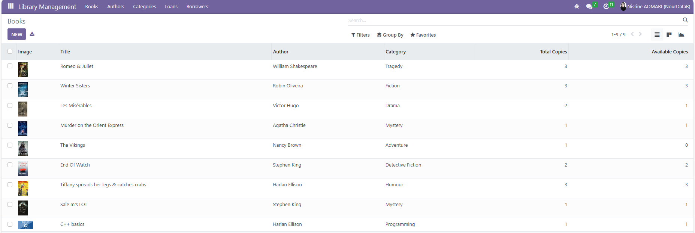

Here you can see the various books available in the library.

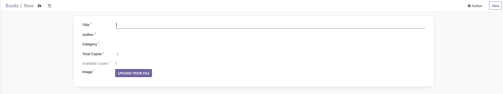

You can add a new book

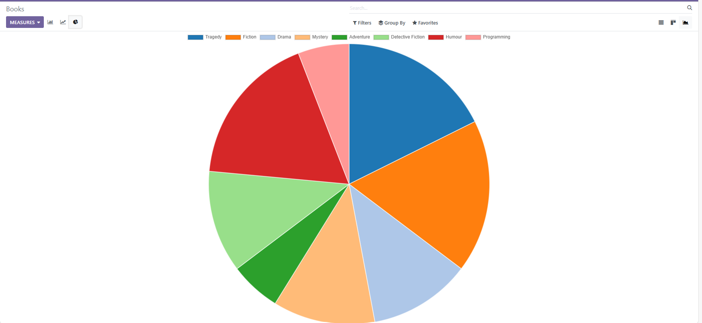

Explore the charts related to your books.

* #### Authors Section:
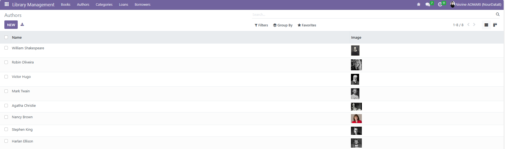

Here you will find the various authors of your available books.

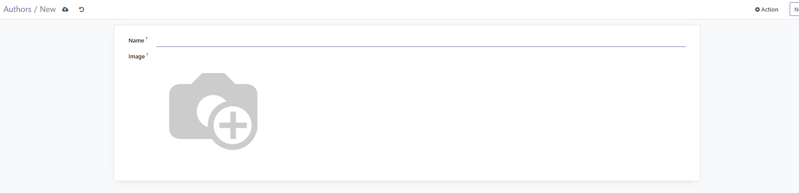

You can even add a new author if you want.

* #### Category Section:
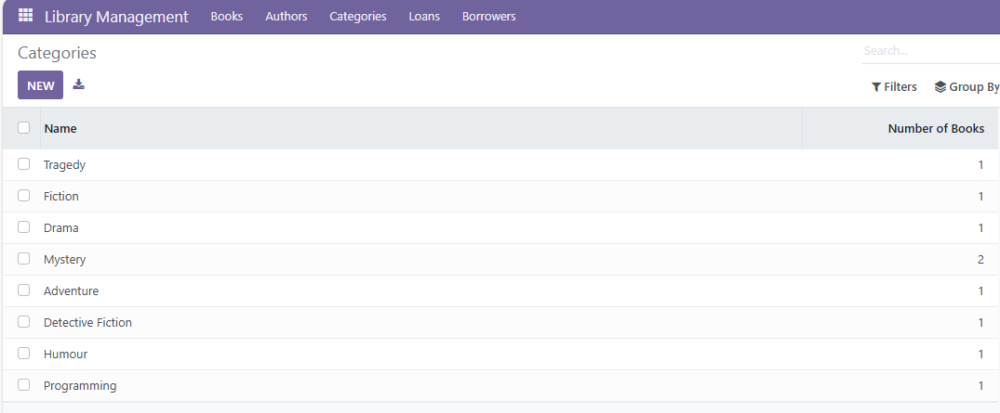

* #### Borrowers Section:
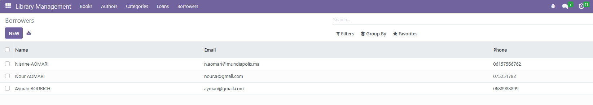
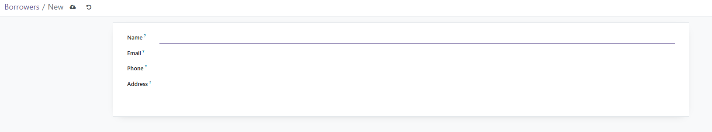

* #### Loans Section:
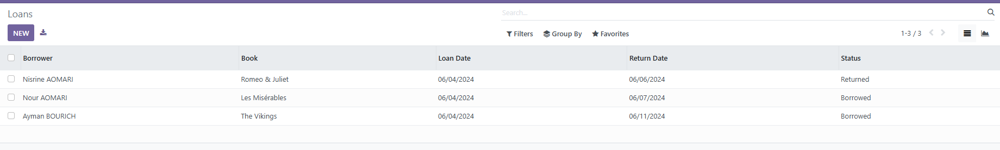
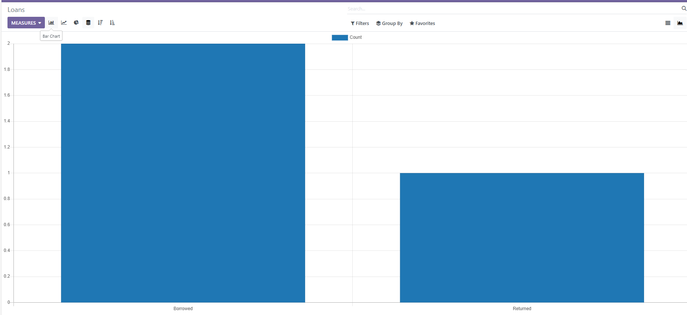
